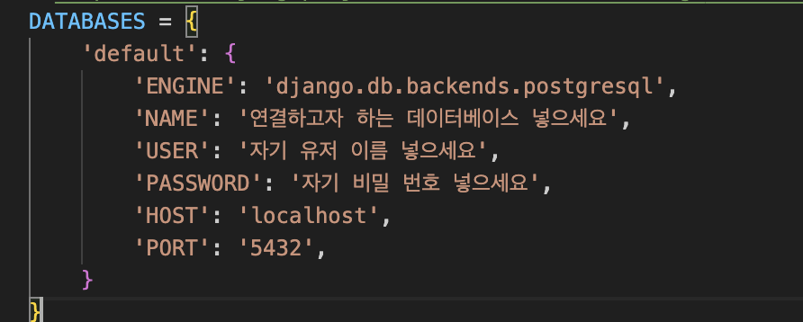

# Database

# django ORM

django ORM(Object Relational Mapper)는 django application이 DB와 상호작용하는 방법이다. 
django ORM은 SQL명령문이 아닌 python 코드로 DB를 다룰 수 있게 한다. 

이에 대한 자세한 내용을 알고 싶으면 → [django](../week3/django/django%20basico.md)

django ORM과 model에 관한 설명은 Week3-django에서 해놨으므로 django에서 제공하는 model API를 이용해서 CRUD를 어떻게 수행하는지 알아보자 

<br/>

## Create(생성)

<br/><br/>


두가지 방법을 설명하겠다. 

1. 새로운 모델 객체를 만들고 `.save()` 메서드 사용해서 DB에 Create

```python
from polls.models import Question
##polls는 django app이름 
##Question은 models.py에 정의한 객체 이름

Q = Question(question_text = "hello world", pub_date = timezone.now())
Q.save()
```

1. `.create()`메서드를 이용해서 한번에 생성 

```python
Question.objects.create(question_text="hellow world2", pub_date = timezone.now())
```

<br/><br/>

## Read(조회)

1. 모든 데이터 조회

```python
Question.objects.all() 

##output
<QuerySet [<Question: Question object (2)>, <Question: Question object (4)>, <Question: Question object (5)>]>
```

DB의 Question테이블에 저장되어 있는 모든 목록을 가져온다.

<br/>

2. 원하는 데이터만 조회 

`.get()` 이나 `.filter()` 메서드를 사용할 수 있다. 

예시로 DB에 저장된 데이터의 id를 이용해서 데이터를 꺼내와 보자

```python
##.get()메서드 사용
Question.objects.get(id=2)
##output
<Question: Question object (2)>

##.filter()메서드 사용
Question.objects.filter(id=2)
##output
<QuerySet [<Question: Question object (2)>]>
```

각 메서드의 output에서 볼 수 있듯이 

`get()` 메서드를 사용할 경우 조건에 맞는 객체 그자체를 꺼내오고

`filter()` 메서드를 사용할 경우 조건 맞는 객체’들’을 배열로 묶어서 QuerySet객체에 담겨서 꺼내와 진다.

DB에서 한번에 여러개의 Data를 조회하고 싶을때는 `filter()` 를 사용하면 된다. 

`get()` 은 조건에 맞는 데이터가 DB상에 존재하지 않을때 `DoesNotExist` 예외를 발생 시킨다.

`filter()` 는 조건에 맞는 데이터가 DB상에 존재하지 않을때 그냥 빈 QuerySet객체를 반환한다. 

<br/><br/>

## Update (수정)

원하는 데이터를 get으로 꺼내와서 값을 바꾸고 `.save()`를 이용해서 저장하면 된다. 

```python
####수정전
Question.objects.get(id=2).question_text
##output
'hello' 

####수정
q = Question.objects.get(id=2)
q.question_text = 'bye'
q.save()
Question.objects.get(id=2).question_text
##output
'bye'
```

<br/><br/>

## Delete(삭제)

`delete()`메서드를 사용

```python
Question.obejcts.get(id=2)
##output 
'bye'

Question.objects.get(id=2).delete()
##output
(1, {'polls.Question': 1})

##이렇게 삭제를 하고 Question.objects.get(id=2)를 통해 다시 가져오려고 하면 가져와 지지 않는다.
##filter메서드는 조건에 해당하는 Data가 DB에 없으면 빈 쿼리셋을 반환했다. 아래를 보라.
Question.objects.filter(id=2)
##otuput
<QuerySet []>
```
<br/><br/>


# PostgreSQL

<aside>
💡

다른 것들이랑 비교해서 어떻게 차이나는지 (장단점 설명)

→ django랑 연결하는거 설명 (django settings) 

→ 실제로 django에서 model만들어서 migrate하면 PostgreSQL에 반영되는거 보여주기 

</aside>
<br/>

## PostgreSQL란?

PostgreSQL은 뛰어난 안정성, 유연성, 개방형 기술 표준 지원으로 잘 알려져 있는 오픈 소스 데이터베이스이다.

관계형, 비관계형 데이터 유형을 모두 지원한다.

## Django와 연결하기

pgadmin이라는 postgreSQL GUI Tool이 있는데 우리는 이 도구를 이용했다. 

1. 데이터 베이스 생성 


<br/>


2. django [settings.py](http://settings.py) 설정


    

`'NAME' : 연결하고자 하는 DB이름 기입`

`'USER' : postgreSQL 자기 username 기입` 

`'PASSWORD' : postgreSQL 자기 비밀번호 기입`

이렇게 하면 성공적으로 djagno application과 postgreSQL DB가 연결이 된다. 

이제 django의 ORM system을 통해서 간편하게 DB를 조작할 수 있다.
